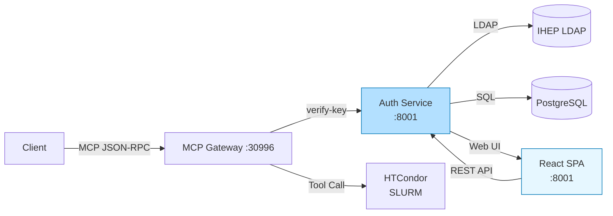
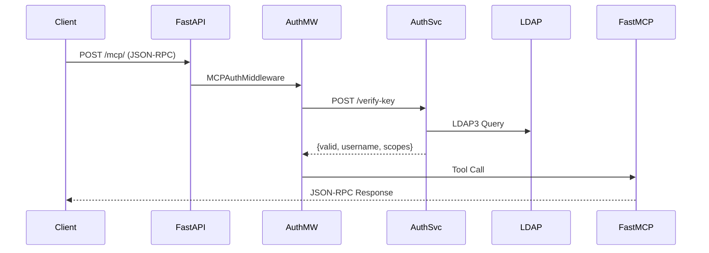
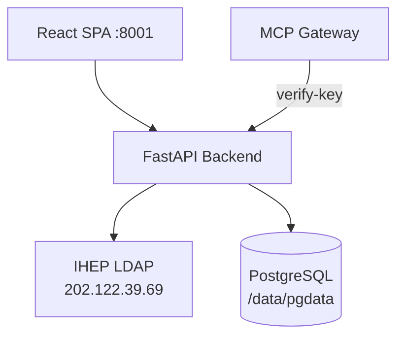
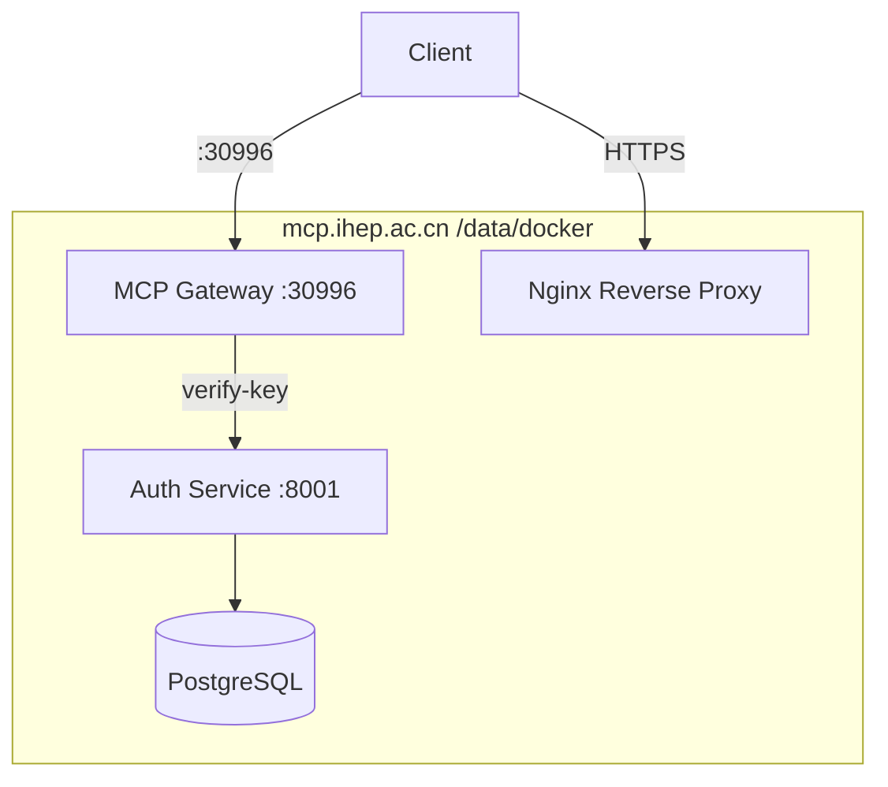

# IHEP MCP System

## Model Context Protocol Infrastructure for IHEP

**IHEP Computing Center**

<mdi-server-network /> MCP Gateway · Auth Service · Docker Deployment

---
layout: side-title
title: Table of Contents
color: rose-light
align: cm-lm
---

:: title ::
# Table of Contents

:: content ::
- **Project Overview** — Three Subprojects
- **System Architecture** — End-to-End Design
- **MCP Gateway** — Gateway Service
- **Auth Service** — Authentication and Authorization
- **Deployment Plan** — Docker Containerization
- **Functional Validation** — Test Results

---
layout: default
color: gray-light
---

# Project Overview

<mdi-package-variant-closed /> This project consists of **three independent repositories**, all hosted on IHEP GitLab.

**`ihep-mcp-server`** — MCP Gateway service, implemented with FastAPI + FastMCP for JSON-RPC protocol forwarding and tool scheduling.

**`ihep-mcp-web`** — Auth Service, with a React SPA frontend and FastAPI backend, providing user registration, API Key management, LDAP authentication, and other core features.

**`IHEP-MCP-dep`** — Docker deployment configuration. Docker Compose provides one-command deployment and containerized operation for MCP Gateway, Auth Service, and PostgreSQL.

| Repository | Function | Tech Stack |
|---|---|---|
| `ihep-mcp-server` | MCP Gateway | FastAPI + FastMCP |
| `ihep-mcp-web` | Auth Service | FastAPI + React + PG |
| `IHEP-MCP-dep` | Docker Deployment | Docker Compose |

**Code path:** `code.ihep.ac.cn/mcp/`

---
layout: default
color: gray-light
---

# System Architecture

<mdi-server-network /> The MCP System uses a **layered and decoupled** architecture. Clients communicate with the gateway through the standard MCP JSON-RPC protocol.

**Authentication flow:** Client → FastAPI → MCPAuthMiddleware → Auth Service → LDAP + PostgreSQL → Authorization result → FastMCP tool execution.

**Tool flow:** Gateway receives request → Verifies Key → Invokes FastMCP → Triggers backend tools (HTCondor / SLURM / weather / user lookup, etc.).



---
layout: default
color: gray-light
---

# MCP Gateway — Request Flow

<mdi-server-network /> MCP Gateway is the core entry point of the system and is implemented on the FastMCP framework.

**Core responsibilities:** Receive client JSON-RPC requests, verify API Keys, enforce authorization through MCPAuthMiddleware, and dispatch tool calls.



---
layout: default
color: gray-light
---

# MCP Gateway — 24 Tools

<mdi-tools /> A total of **24 tools** are registered, covering cluster status queries, HTCondor job management, weather queries, user information, and more.

**Security model:** Tools are divided into three security levels: public (no authentication), protected (Key required), and HPC-specific (Scope isolation).

| Type | Count | Auth | Representative Tools |
|---|---|---|---|
| Public | 3 | ❌ | cluster_status, queue_status, manual_search |
| Protected | 4 | ✅ | whoami, query_my_jobs, submit_job, cancel_my_job |
| HTCondor | 11 | ✅ | job_status, job_submit, job_cancel... |
| Weather | 5 | ✅ | weather_beijing, weather_shanghai... |
| User | 1 | ✅ | search_user |

---
layout: default
color: gray-light
---

# Auth Service — Architecture

<mdi-shield-account /> Auth Service provides unified identity authentication and authorization based on a two-layer LDAP + RBAC model.

**Authentication methods:** Supports LDAP username/password login, anonymous API Key access for protected tools, and OAuth-compatible error formatting to prevent redirect loops.

**Permission model:** Users are bound to Roles, Roles are bound to Scopes, and per-user Scope overrides are supported.



---
layout: two-cols
color: gray-light
---

:: left ::

# Auth Service — LDAP

<mdi-shield-account /> IHEP LDAP attribute mapping and OAuth compatibility design.

**LDAP attribute mapping:**

| LDAP Attribute | Purpose |
|---|---|
| `afs` | Linux username |
| `cn` | Multi-value [email, username] |
| `email` | Email address |
| `trueName` | Chinese display name |

**OAuth compatibility:** RFC 6749 error format to avoid 404 redirect loops.

:: right ::

# 9 Database Tables

<mdi-database /> There are 9 tables in total, grouped into core, authorization, and audit categories:

**Core:** users · api_keys · roles · user_roles

**Authorization:** scopes · role_scopes · user_scope_overrides

**Audit:** auth_audit_logs · admin_audit_logs

See the next slide for detailed schemas →

---
layout: two-cols
color: gray-light
---

:: left ::

<div style="font-size: 0.65em;">

# Database Tables — Core and Auth

**users**

| Field | Type | Description |
|---|---|---|
| id | UUID | Primary key |
| username | VARCHAR | Linux username |
| email | VARCHAR | Email |
| true_name | VARCHAR | Chinese name |
| created_at | TIMESTAMP | Created time |

**api_keys**

| Field | Type | Description |
|---|---|---|
| id | UUID | Primary key |
| user_id | UUID | Linked users |
| key_hash | VARCHAR | SHA256 hash |
| is_active | BOOLEAN | Active or not |

</div>

:: right ::

<div style="font-size: 0.45em;">

# Database Tables — Roles and Audit

**roles / user_roles**

| Table | Description |
|---|---|
| roles | admin/user/readonly |
| user_roles | User-role many-to-many |

**scopes / role_scopes**

| Table | Description |
|---|---|
| scopes | cluster_read/job_submit |
| role_scopes | Role-scope many-to-many |

**user_scope_overrides**

| Field | Description |
|---|---|
| user_id / scope | User and scope |
| action | allow / deny |

<!-- **auth_audit_logs** -->
<!--  -->
<!-- | Field | Description | -->
<!-- |---|---| -->
<!-- | user_id / event | User and event | -->
<!-- | result / ip | Result and IP | -->
<!-- | created_at | Time | -->
<!--  -->
<!-- **admin_audit_logs** -->
<!--  -->
<!-- | Field | Description | -->
<!-- |---|---| -->
<!-- | admin_user_id | Administrator | -->
<!-- | action / target | Action and target | -->

</div>

---
layout: default
color: gray-light
---

# Auth Service — API Endpoints

<mdi-api /> Key API endpoints for MCP Gateway and Auth Service:

| Endpoint | Method | Purpose |
|---|---|---|
| `/mcp/` | POST | MCP JSON-RPC entry point (Gateway) |
| `/api/v1/login` | POST | LDAP user login |
| `/api/v1/logout` | POST | Session logout |
| `/api/v1/me` | GET | Current user information |
| `/api/v1/me/api-keys` | GET/POST/DELETE | API Key management |
| `/api/v1/auth/verify-key` | POST | Key verification (called by Gateway) |

<mdi-shield-check /> LDAP + RBAC two-layer authorization · RFC 6749 OAuth error format

---
layout: default
color: gray-light
---

# Deployment Plan

<mdi-docker /> The deployment target is the **mcp.ihep.ac.cn** production server, using an All-in-One Docker Compose structure.



**Disks:** `/data/docker` (196G) · `/data/pgdata` · Root partition 79%→66%

**Notes:**
- IPv6 `localhost` resolves to `::1` first. Use `curl -4` or `127.0.0.1`.
- Docker Hub image pulls require a proxy.
- **Restart services:** `cd /data/IHEP-MCP-Server && docker compose restart`

---
layout: default
color: gray-light
---

# Functional Validation

<mdi-check-circle /> Full functional validation was completed on 2026-05-06, covering the protocol layer, authentication layer, and tool layer.

<div style="font-size: 0.8em;">

**Verified items:**

| Test Item | Status |
|---|---|
| Health Check | ✅ `{"status":"healthy"}` |
| tools/list (24 tools) | ✅ |
| cluster_status / queue_status / manual_search | ✅ |
| Protected tool call without Key | ✅ 401 AUTH_REQUIRED |
| Auth verify-key | ✅ |
| OAuth compatibility | ✅ |
| Docker data migration | ✅ `/data/docker` |

**Current progress:** MCP Gateway authorization ✅ · Tool registration (24 tools) ✅ · Docker deployment ✅ · Auth Service LDAP ✅ · API Key management ✅ · Frontend UI 🔧 Basically usable

**To improve:** Hard-coded cluster/queue_status values · Missing scope declarations for HTCondor tools

</div>

---
layout: iframe-right
color: gray-light
url: https://mcp.ihep.ac.cn:8001
---


<div style="padding-right: 1em;">

# Auth Service — Admin Console

<mdi-web /> Auth Service provides a complete Web admin interface for visual management of users, roles, and API Keys.

**Feature modules:**

- User login / registration
- API Key request and management
- Role and Scope assignment
- Operation audit logs

</div>

---
layout: default
color: gray-light
---

# FastMCP — Multi-Backend Routing

<mdi-server-network /> The FastMCP framework natively supports **multi-backend MCP Server routing** and can connect to multiple independent MCP service endpoints at the same time.

**Routing mechanism:**

| Feature | Description |
|---|---|
| Dynamic registration | Add/remove backends through APIs at runtime |
| Intelligent routing | Automatically dispatch requests to the corresponding backend based on request parameters |
| Failover | Automatically switch to fallback nodes when a backend is unavailable |
| Unified entry point | Clients only connect to the Gateway and do not need to know backend distribution |

**Use cases:**
- Unified management of multiple HPC clusters (HTCondor / SLURM / PBS)
- Third-party service integration (OIDC / CCS)

---
layout: default
color: gray-light
---

# MCP Development Flow

<mdi-source-branch /> To extend MCP Gateway, developers only need to add routing declarations to the tool registry before publishing new tools.

**Development steps:**

```python
@mcp.tool()
async def my_tool(arg1: str) -> str:
    return f"Result: {arg1}"
```


**Third-party data source compatibility:**

<mdi-database /> Auth Service / FastMCP supports integration with external identity sources and data systems:

| External System | Integration Method |
|---|---|
| IHEP CCS | LDAP attribute mapping |
| OIDC Provider | OAuth 2.0 / OIDC protocol |
| External REST API | FastMCP HTTP transport layer |

<mdi-shield-check /> All third-party integrations use standard protocols and do not break the existing authorization model.

---
layout: credits
color: navy
---

# Thank You

<mdi-heart /> IHEP Computing Center
