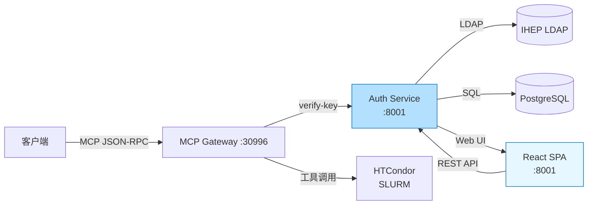
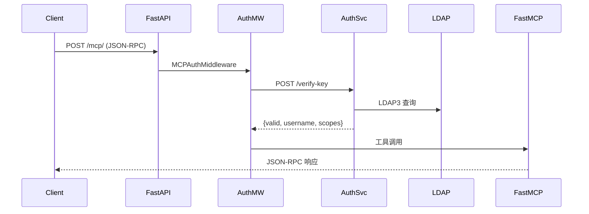
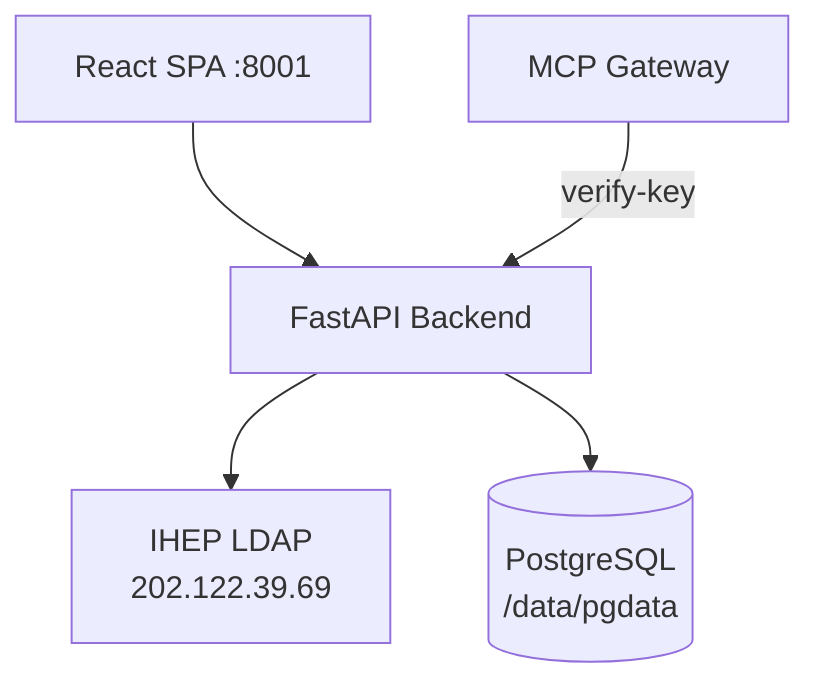
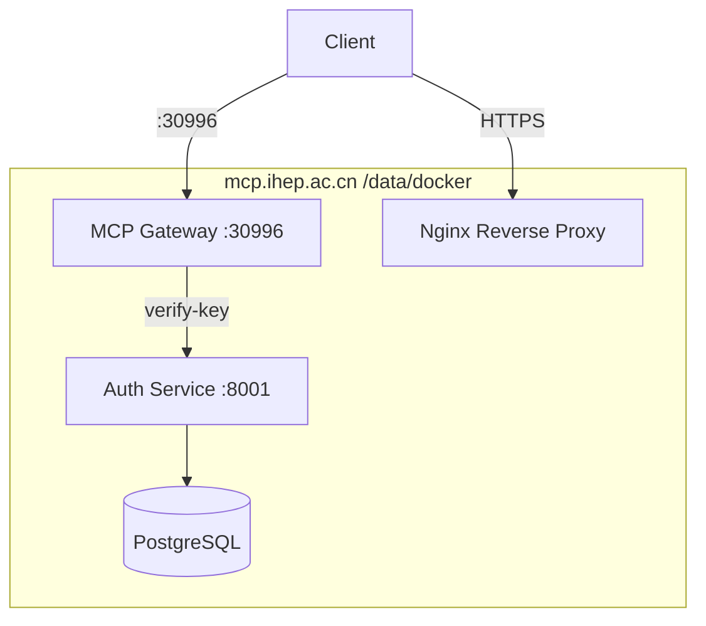

# IHEP MCP System

## 高能所模型上下文协议基础设施

**IHEP Computing Center**

<mdi-server-network /> MCP Gateway · Auth Service · Docker Deployment

---
layout: center
color: rose-light
---

# 目录

- **项目概览** — 三个子项目
- **系统架构** — 全链路设计
- **MCP Gateway** — 网关服务
- **Auth Service** — 认证授权
- **部署方案** — Docker 容器化
- **功能验证** — 测试结果

---
layout: default
color: gray-light
---

# 项目概览

<mdi-package-variant-closed /> 本项目由 **三个独立仓库** 组成，统一托管于 IHEP GitLab。

**`ihep-mcp-server`** — MCP Gateway 网关服务，基于 FastAPI + FastMCP 实现 JSON-RPC 协议转发与工具调度。

**`ihep-mcp-web`** — Auth Service 认证服务，前端 React SPA + 后端 FastAPI，提供用户注册、API Key 管理、LDAP 认证等核心功能。

**`IHEP-MCP-dep`** — Docker 部署配置，通过 Docker Compose 实现一键部署，支持 MCP Gateway、Auth Service、PostgreSQL 的容器化运行。

| 仓库 | 功能 | 技术栈 |
|---|---|---|
| `ihep-mcp-server` | MCP Gateway | FastAPI + FastMCP |
| `ihep-mcp-web` | Auth Service | FastAPI + React + PG |
| `IHEP-MCP-dep` | Docker 部署 | Docker Compose |

**代码路径：** `code.ihep.ac.cn/mcp/`

---
layout: default
color: gray-light
---

# 系统架构

<mdi-server-network /> MCP System 采用 **分层解耦** 架构，客户端通过标准 MCP JSON-RPC 协议与网关通信。

**认证链路：** 客户端 → FastAPI → MCPAuthMiddleware → Auth Service → LDAP + PostgreSQL → 返回鉴权结果 → FastMCP 执行工具。

**工具链路：** 网关接收请求 → 验证 Key → 调用 FastMCP → 触发后端工具（HTCondor / SLURM / 天气 / 用户查询等）。



---
layout: default
color: gray-light
---

# MCP Gateway — 请求链路

<mdi-server-network /> MCP Gateway 是整个系统的核心入口，基于 FastMCP 框架实现。

**核心职责：** 接收客户端 JSON-RPC 请求、验证 API Key、通过 MCPAuthMiddleware 拦截鉴权、分发工具调用。



---
layout: default
color: gray-light
---

# MCP Gateway — 24 个工具

<mdi-tools /> 共注册 **24 个工具**，涵盖集群状态查询、HTCondor 作业管理、天气查询、用户信息等场景。

**安全模型：** 工具分为公开（无需认证）、受保护（需 Key）、HPC 专用（Scope 隔离）三个安全级别。

| 类型 | 数量 | 鉴权 | 代表工具 |
|---|---|---|---|
| 公开 | 3 | ❌ | cluster_status, queue_status, manual_search |
| 受保护 | 4 | ✅ | whoami, query_my_jobs, submit_job, cancel_my_job |
| HTCondor | 11 | ✅ | job_status, job_submit, job_cancel... |
| 天气 | 5 | ✅ | weather_beijing, weather_shanghai... |
| 用户 | 1 | ✅ | search_user |

---
layout: default
color: gray-light
---

# Auth Service — 架构

<mdi-shield-account /> Auth Service 提供统一的身份认证与授权服务，基于 LDAP + RBAC 双层鉴权。

**认证方式：** 支持 LDAP 用户名密码登录、API Key 匿名访问（受保护工具）、OAuth 错误格式兼容（防重定向循环）。

**权限模型：** 用户绑定角色（Role），角色绑定权限范围（Scope），支持个人 Scope 覆盖。



---
layout: two-cols
color: gray-light
---

:: left ::

# Auth Service — LDAP

<mdi-shield-account /> IHEP LDAP 属性映射与 OAuth 兼容性设计。

**LDAP 属性映射：**

| LDAP 属性 | 用途 |
|---|---|
| `afs` | Linux 用户名 |
| `cn` | 多值 [邮箱, 用户名] |
| `email` | 邮箱地址 |
| `trueName` | 中文显示名 |

**OAuth 兼容性：** RFC 6749 错误格式，避免 404 重定向循环。

:: right ::

# 9 张数据库表

<mdi-database /> 共 9 张表，分为核心、鉴权、审计三类：

**核心：** users · api_keys · roles · user_roles

**鉴权：** scopes · role_scopes · user_scope_overrides

**审计：** auth_audit_logs · admin_audit_logs

详细 schema 见下页 →

---
layout: two-cols
color: gray-light
---

:: left ::

<div style="font-size: 0.65em;">

# 数据库表 — 核心与鉴权

**users**

| 字段 | 类型 | 说明 |
|---|---|---|
| id | UUID | 主键 |
| username | VARCHAR | Linux 用户名 |
| email | VARCHAR | 邮箱 |
| true_name | VARCHAR | 中文名 |
| created_at | TIMESTAMP | 创建时间 |

**api_keys**

| 字段 | 类型 | 说明 |
|---|---|---|
| id | UUID | 主键 |
| user_id | UUID | 关联 users |
| key_hash | VARCHAR | SHA256 哈希 |
| is_active | BOOLEAN | 是否有效 |

</div>

:: right ::

<div style="font-size: 0.45em;">

# 数据库表 — 角色与审计

**roles / user_roles**

| 表名 | 说明 |
|---|---|
| roles | admin/user/readonly |
| user_roles | 用户-角色多对多 |

**scopes / role_scopes**

| 表名 | 说明 |
|---|---|
| scopes | cluster_read/job_submit |
| role_scopes | 角色-权限多对多 |

**user_scope_overrides**

| 字段 | 说明 |
|---|---|
| user_id / scope | 用户、权限 |
| action | allow / deny |

<!-- **auth_audit_logs** -->
<!--  -->
<!-- | 字段 | 说明 | -->
<!-- |---|---| -->
<!-- | user_id / event | 用户、事件 | -->
<!-- | result / ip | 结果、IP | -->
<!-- | created_at | 时间 | -->
<!--  -->
<!-- **admin_audit_logs** -->
<!--  -->
<!-- | 字段 | 说明 | -->
<!-- |---|---| -->
<!-- | admin_user_id | 管理员 | -->
<!-- | action / target | 操作、目标 | -->

</div>

---
layout: default
color: gray-light
---

# Auth Service — API 端点

<mdi-api /> MCP Gateway 与 Auth Service 的关键 API 端点：

| 端点 | 方法 | 用途 |
|---|---|---|
| `/mcp/` | POST | MCP JSON-RPC 入口（Gateway） |
| `/api/v1/login` | POST | LDAP 用户登录 |
| `/api/v1/logout` | POST | 会话登出 |
| `/api/v1/me` | GET | 当前用户信息 |
| `/api/v1/me/api-keys` | GET/POST/DELETE | API Key 管理 |
| `/api/v1/auth/verify-key` | POST | Key 校验（Gateway 调用） |

<mdi-shield-check /> LDAP + RBAC 双层鉴权 · RFC 6749 OAuth 错误格式

---
layout: default
color: gray-light
---

# 部署方案

<mdi-docker /> 部署目标为 **mcp.ihep.ac.cn** 生产服务器，All-in-One Docker Compose 结构。



**磁盘：** `/data/docker` (196G) · `/data/pgdata` · 根分区 79%→66%

**注意事项：**
- IPv6 `localhost` 优先解析 `::1`，curl 需加 `-4` 或用 `127.0.0.1`
- Docker Hub 需走代理拉取镜像
- **重启服务：** `cd /data/IHEP-MCP-Server && docker compose restart`

---
layout: default
color: gray-light
---

# 功能验证

<mdi-check-circle /> 本系统已于 2026-05-06 完成全面功能验证，覆盖协议层、认证层、工具层。

<div style="font-size: 0.8em;">

**已验证项：**

| 测试项 | 状态 |
|---|---|
| Health Check | ✅ `{"status":"healthy"}` |
| tools/list（24 工具） | ✅ |
| cluster_status / queue_status / manual_search | ✅ |
| 无 Key 调用受保护工具 | ✅ 401 AUTH_REQUIRED |
| Auth verify-key | ✅ |
| OAuth 兼容性 | ✅ |
| Docker 数据迁移 | ✅ `/data/docker` |

**当前进度：** MCP Gateway 鉴权 ✅ · 工具注册（24 个）✅ · Docker 部署 ✅ · Auth Service LDAP ✅ · API Key 管理 ✅ · 前端 UI 🔧 基本可用

**待完善：** cluster/queue_status 硬编码问题 · HTCondor 工具缺少 scope 声明

</div>

---
layout: iframe-right
color: gray-light
url: https://mcp.ihep.ac.cn:8001
---


<div style="padding-right: 1em;">

# Auth Service — 管理后台

<mdi-web /> Auth Service 提供完整的 Web 管理界面，支持用户、角色、API Key 的可视化操作。

**功能模块：**

- 用户登录 / 注册
- API Key 申请与管理
- 角色与 Scope 分配
- 操作审计日志

</div>

---
layout: default
color: gray-light
---

# FastMCP — 多后端路由

<mdi-server-network /> FastMCP 框架原生支持 **多后端 MCP Server 路由**，可同时连接多个独立的 MCP 服务端点。

**路由机制：**

| 特性 | 说明 |
|---|---|
| 动态注册 | 运行时通过 API 添加/移除后端 |
| 智能路由 | 根据请求参数自动分发到对应后端 |
| 故障转移 | 后端不可用时自动切换备选节点 |
| 统一入口 | 客户端只需连接 Gateway，无需感知后端分布 |

**适用场景：**
- 多 HPC 集群（HTCondor / SLURM / PBS）统一管理
- 第三方服务接入（OIDC / CCS）

---
layout: default
color: gray-light
---

# MCP 开发流程

<mdi-source-branch /> 开发者扩展 MCP Gateway，只需在工具注册表中添加路由声明，即可上线新工具。

**开发步骤：**

```python
@mcp.tool()
async def my_tool(arg1: str) -> str:
    return f"Result: {arg1}"
```


**第三方数据源兼容：**

<mdi-database /> Auth Service / FastMCP 支持对接外部身份源与数据系统：

| 外部系统 | 接入方式 |
|---|---|
| IHEP CCS | LDAP 属性映射 |
| OIDC Provider | OAuth 2.0 / OIDC 协议 |
| 外部 REST API | FastMCP HTTP 传输层 |

<mdi-shield-check /> 所有第三方接入均通过标准协议，不破坏现有鉴权模型。

---
layout: credits
color: navy
---

# 谢谢

<mdi-heart /> IHEP Computing Center
